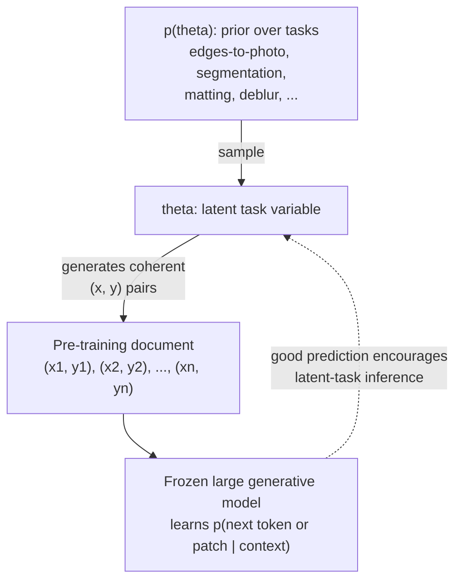
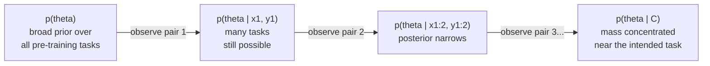
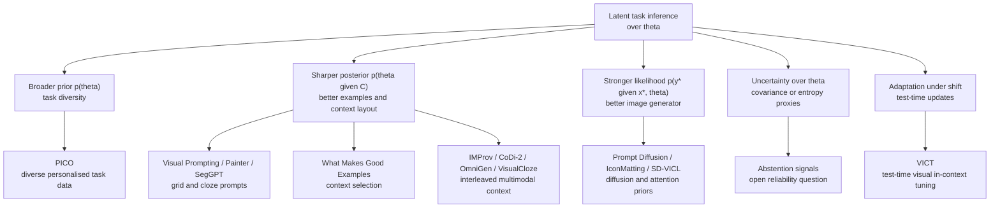
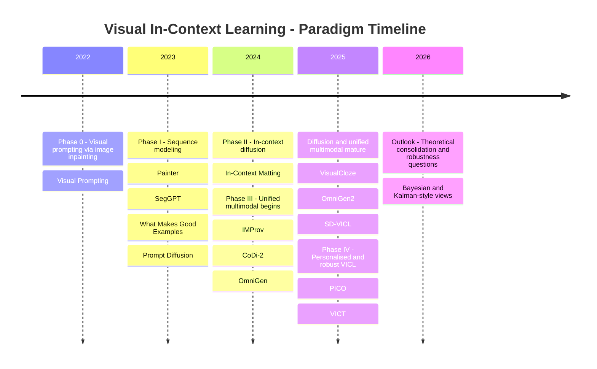
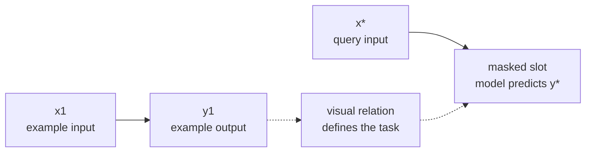

# DATA8018-Final_report-VICL

# Visual In-Context Learning: From Pixel Prompts to Bayesian Task Inference

> A literature review tracing the evolution of Visual In-Context Learning (VICL), the emerging paradigm that lets frozen or mostly frozen vision foundation models perform new visual tasks from a handful of demonstration pairs, often with little or no task-specific training.

---

## Table of Contents

1. [Why VICL Matters](#why-vicl-matters)
2. [Part I - Theoretical Foundations](#part-i---theoretical-foundations)
   - 2.1 The Bayesian Lens
   - 2.2 ICL as Posterior Predictive Distribution
   - 2.3 Visualising the Posterior Update
   - 2.4 Bayesian Scaling Laws
   - 2.5 ICL as Kalman Filtering
3. [Part II - Application Evolution (2022-2025, with 2026 Outlook)](#part-ii---application-evolution-2022-2025-with-2026-outlook)
   - Phase 0: Visual Prompting via Image Inpainting
   - Phase I: Visual Prompting as Sequence Modeling
   - Phase II: In-Context Diffusion
   - Phase III: Unified Multimodal Generation
   - Phase IV: Personalised and Robust VICL
4. [Cross-Cutting Challenges](#cross-cutting-challenges)
5. [Future Research Questions](#future-research-questions)
6. [References](#references)

---

## Why VICL Matters

Before the recent wave of visual prompting, deploying a vision model on a new task usually meant one of three things: (i) collect labels and fine-tune, (ii) train an adapter or LoRA on top of a frozen backbone, or (iii) hand-craft an inductive prior or task-specific pipeline. All three routes rely on some form of parameter update, auxiliary module, or task-specific engineering.

Large language models challenged that habit of thought. GPT-3 showed that, given a frozen network and a few input-output examples in the prompt, a model could solve unseen tasks at inference time. This is In-Context Learning (ICL): the network's weights do not change; the task is induced from the context.

Visual In-Context Learning (VICL) asks the analogous question for vision:

> Can we condition a large generative vision model on a few demonstration pairs $(x_1, y_1), \dots, (x_k, y_k)$ and a query $x^*$, and have it produce $y^*$ for a new task - segmentation, matting, sketch-to-photo, dehazing, identity-preserving editing - without task-specific tuning?

Recent systems give a partial yes, with important caveats. The useful way to read that progress is in two halves: a theoretical lens for why context can specify a visual task, and an application timeline showing how researchers have built that idea into working systems.

The Bayesian framing is not the only possible explanation of ICL, but it gives a compact language for the rest of the post: prior, context evidence, posterior concentration, and uncertainty.

---

## Part I - Theoretical Foundations

A common pitfall in ICL discussions is to treat the phenomenon as "the model just figures it out." A more useful view is conditional and probabilistic. Under a hierarchical latent-task assumption, ICL can be modelled as approximate Bayesian inference over a hidden task variable; scaling laws, context-selection sensitivity, many-shot re-emergence, and some robustness failures then become easier to reason about. This section should therefore be read as a theoretical lens, not as a proof that every VICL system literally runs Bayes' rule internally.

### 2.1 The Bayesian Lens - Setup

Assume pre-training data is generated by a hierarchical latent-variable process:

1. A latent task or concept $\theta$ is sampled from a prior $p(\theta)$. Examples of $\theta$ include "edge-to-photo translation," "remove glasses while preserving identity," and "binary segmentation of cats."
2. Conditioned on $\theta$, a coherent document of paired observations is generated: $(x_1, y_1), (x_2, y_2), \dots, (x_n, y_n) \sim p(\cdot \mid \theta)$.
3. The model never sees $\theta$ directly; it only sees the resulting flat sequence.

Pre-training minimises the cross-entropy of the next-token or next-patch distribution over these sequences. If the data really is organised this way, then a model that predicts the sequence well has an incentive to infer which latent task generated the current context, because otherwise it cannot extrapolate beyond the first few examples.

Why this matters: in this stylised setting, ICL is not an unexplained trick. It is the test-time use of a latent-task inference capability encouraged by the training objective. The foundational reference here is Xie et al., _An Explanation of In-Context Learning as Implicit Bayesian Inference_ (ICLR 2022). The same argument does not automatically prove VICL, but it gives a clean vocabulary for talking about visual demonstrations as evidence about a hidden task.

### 2.2 ICL as Posterior Predictive Distribution

At inference time, we feed the model a context $C = \{(x_1, y_1), \dots, (x_k, y_k)\}$ and a query $x^*$. Under the Bayesian view, the target prediction is the posterior predictive distribution:

$$
p(y^* \mid x^*, C) = \int_{\Theta} p(y^* \mid x^*, \theta)\,p(\theta \mid C)\,d\theta .
$$

Two pieces are doing the work:

- The posterior $p(\theta \mid C)$ is the model's belief, after seeing $k$ demonstrations, about which task is being requested.
- The likelihood $p(y^* \mid x^*, \theta)$ says what output is plausible for the query once the task is fixed.

This decomposition produces three useful predictions:

| Observation | Bayesian interpretation | Practical implication |
| --- | --- | --- |
| More informative demonstrations help more than redundant ones. | They concentrate $p(\theta \mid C)$ faster. | Context selection can matter as much as model scale. |
| Ambiguous demonstrations produce unstable outputs. | Posterior mass remains spread over multiple plausible tasks. | Evaluation should report sensitivity to context choice. |
| Long contexts can overcome a weak prior in the model. | The likelihood product can dominate the prior under favourable assumptions. | Long-context VICL may improve adaptation, but it also raises safety questions. |

That last row deserves emphasis, with caution: it is a prediction of this modelling framework under particular assumptions, not an unconditional theorem about every deployed model. Still, it has direct safety implications which we will return to.

### 2.3 Visualising the Posterior Update

A useful mental picture: every demonstration pair you append to the prompt is one Bayesian update. Tasks consistent with all the pairs retain mass; tasks inconsistent with any pair lose mass.

This is also why context selection is so consequential: the information a pair contributes to disambiguating $\theta$ varies wildly across pairs. Two examples of "photo of a cat with mask" might collapse onto almost the same posterior, whereas one example of a cat and one of a dog with masks can pin down "binary segmentation" more sharply.

For deployment, example selection is not a minor prompt detail; it is part of the task specification.

### 2.4 Bayesian Scaling Laws

Recent work by Arora et al. (2025) formalises relationships between context length, model size, and task performance through Bayesian scaling laws. Two key quantities are:

- Task prior $p(\theta)$: how likely the model thinks task $\theta$ is before seeing any examples, as shaped by pre-training data composition and post-training.
- Learning efficiency: how quickly $p(\theta \mid C)$ concentrates on the intended task as $|C|$ grows.

One prediction of this framework is many-shot re-emergence. If a model has been aligned away from some task $\theta_{\text{bad}}$, one can model that alignment as suppressing the prior $p(\theta_{\text{bad}})$. A sufficiently consistent and sufficiently long context may still move posterior mass back toward $\theta_{\text{bad}}$, because

$$
p(\theta \mid C) \propto p(\theta)\prod_{i=1}^{k}p(x_i, y_i \mid \theta).
$$

The likelihood term compounds with $k$, while the prior is a fixed multiplicative factor. This is one proposed mechanism behind many-shot jailbreaking in language models. For VICL, the analogous risk is still speculative: a long sequence of benign-looking image pairs might steer a visual generator toward a disallowed visual transformation. The point is not that visual many-shot jailbreaking is already fully demonstrated at scale, but that the Bayesian story gives a concrete place to look.

### 2.5 ICL as Kalman Filtering - A 2026 Perspective

A more recent theoretical thread, represented by Kiruluta's 2026 preprint _Filtering Beats Fine Tuning: A Bayesian Kalman View of In Context Learning in LLMs_, reframes in-context learning as sequential Bayesian state estimation. The paper is about LLMs rather than VICL, so I treat it here as an analogy rather than direct visual evidence.

- Treat $\theta$ as a continuous latent state with a Gaussian belief $\mathcal{N}(\mu_t, \Sigma_t)$.
- Each demonstration acts like an observation; with linear-Gaussian assumptions, Bayes' rule gives the standard Kalman update.
- The covariance $\Sigma_t$ may shrink as informative observations arrive, giving a formal version of "the model is becoming more certain about the task."

Why this matters: the Kalman view suggests an optimisation-inference duality. It sits beside another common explanatory tradition in which ICL resembles fitting a simple predictor on the in-context examples; filtering views show that, under restrictive assumptions, least-squares-style updates arise as a limiting case of Bayesian state estimation. That does not make all ICL literally Kalman filtering, but it gives a useful bridge between two explanatory traditions.

For VICL, the practical lesson is the uncertainty handle. If a system could estimate something like posterior covariance from attention entropy, denoiser variance, or ensemble disagreement, that signal might support selective prediction or abstention when the context is ambiguous.

### 2.6 Putting Theory to Work

The ideas above - implicit Bayesian inference, posterior concentration, scaling laws, and covariance shrinkage - suggest design heuristics without requiring every VICL system to literally implement Bayes' rule:

- Diverse task or tuning data can broaden the support of $p(\theta)$, which is useful if we want VICL to assign mass to held-out tasks. PICO is a useful example at the data-construction and tuning level rather than a direct pre-training result.
- Diverse, disambiguating contexts at test time accelerate posterior concentration.
- Long contexts can override weak priors under favourable assumptions. That is a feature for generalisation and a possible vulnerability for safety.
- Uncertainty estimates, even approximate ones, could become useful signals for selective prediction or abstention.

With this scaffolding in mind, we now turn to how the field has actually built VICL systems.

### 2.7 Theory-to-Application Map

One way to read the application papers is to ask which part of the Bayesian story they improve: the prior over tasks, the context format, the image likelihood, or the reliability signal.

---

## Part II - Application Evolution (2022-2025, with 2026 Outlook)

The applied side of VICL has moved through several overlapping paradigms. The dividing lines are not sharp, and many papers straddle phases, but the dominant architectural commitment changes meaningfully over time.

| Year | Phase | Representative papers | What changed |
| --- | --- | --- | --- |
| 2022 | Visual prompting | Visual Prompting via Image Inpainting | The task becomes a spatial relation inside an image prompt. |
| 2023 | Sequence modelling | Painter, SegGPT, What Makes Good Examples | Grid and completion formats become general visual task interfaces; context choice becomes a measured variable. |
| 2023-2025 | Diffusion VICL | Prompt Diffusion, IconMatting, SD-VICL | Strong diffusion priors and attention manipulation make visual prediction and image-to-image tasks more practical. |
| 2024-2025 | Unified multimodal | IMProv, CoDi-2, OmniGen, OmniGen2, VisualCloze | Context expands from visual exemplars to interleaved text-image sequences and cloze-style training. |
| 2025 onward | Robust and personalised VICL | PICO, VICT, 2026 theory outlook | The field shifts toward task diversity, personalisation, distribution shift, and test-time adaptation. |

The high-level arc is: define the task in pixels, use stronger generative priors, fuse modalities where useful, and then address distribution shift and personalisation.

### Phase 0 - Visual Prompting via Image Inpainting (2022)

Before Painter made the grid interface widely recognisable, _Visual Prompting via Image Inpainting_ (NeurIPS 2022) showed a simple but important trick: cast a visual task as image inpainting. Put an input-output example and a query into a visual prompt, leave the answer region blank, and ask an inpainting model to complete it. This paper matters because it makes the prompt itself a spatial object rather than a string of text.

The idea is simple compared with later foundation-model VICL, but conceptually it is the seed: the task is not named by a label; it is demonstrated by a visual relation.

### Phase I - Visual Prompting as Sequence Modeling (2023)

The move: treat an image as a sequence of patches or tokens, define a task as "complete the sequence," and let a single model handle many tasks via the format of the input.

Painter (CVPR 2023) is the canonical example. Arrange a demonstration pair $(x_1, y_1)$ and a query $x^*$ as a $2 \times 2$ grid image and ask the model to in-paint the missing fourth quadrant.

| Position | Left cell | Right cell |
| --- | --- | --- |
| Top row | Demonstration input $x_1$ | Demonstration output $y_1$ |
| Bottom row | Query input $x^*$ | Masked output slot, completed as $y^*$ |

The task - depth estimation, semantic segmentation, denoising, low-light enhancement - is communicated by the visual relationship between the top two cells. No text prompt, task-id embedding, or task-specific head is required at inference time.

SegGPT (ICCV 2023) specialises this idea for universal segmentation. Its key generalisation is random colouring of mask labels at training time, which forces the model to read the colour-to-class mapping from the in-context exemplar. As a result, SegGPT can perform semantic, instance, panoptic, and video object segmentation with a single set of weights.

_What Makes Good Examples for Visual In-Context Learning?_ (NeurIPS 2023) adds a crucial empirical lesson: the choice of demonstration examples can change performance dramatically. In the Bayesian vocabulary above, good examples are those that concentrate the posterior over the intended task quickly.

What Phase I made clear:

1. The grid or completion format is a workable interface for visual tasks.
2. Masked-image-modelling backbones can support visual task transfer through context.
3. Detail consistency remains hard: producing the right kind of output is easier than preserving fine boundaries, texture, and geometry.

### Phase II - The Rise of In-Context Diffusion (2023-2025)

The move: replace or augment masked-image-modelling backbones with large diffusion models. Diffusion models bring a much richer generative prior over natural images, and their attention layers provide a natural place for context information to interact with query generation.

Prompt Diffusion, introduced in _In-Context Learning Unlocked for Diffusion Models_ (2023), is an important bridge here. It trains a diffusion framework for in-context visual prompting, showing that diffusion-based generation can learn from prompt examples rather than only from text instructions.

IconMatting / In-Context Matting (CVPR 2024) ports VICL into one of the most precision-sensitive vision tasks: alpha matting. Its setting uses a reference image with guided priors such as points, scribbles, or masks, then estimates alpha mattes for target images from the same foreground category without requiring a per-image trimap. This is useful evidence that VICL is not limited to coarse, discrete tasks, but the category and guidance assumptions matter.

SD-VICL (_Stable Diffusion Models are Secretly Good at Visual In-Context Learning_, ICCV 2025) pushes a sharper claim: a frozen Stable Diffusion model can perform several visual prediction and image-to-image tasks, including foreground segmentation, single-object detection, semantic segmentation, keypoint detection, edge detection, and colorization, when prompted in the right spatial layout and guided through attention-map manipulation, without fine-tuning, ControlNet, or LoRA.

In Bayesian language, the diffusion denoiser supplies a strong conditional image prior, while attention gives the context $C$ a path to influence the query output.

What Phase II showed:

1. Strong generative priors make VICL useful beyond grid completion.
2. Test-time attention engineering can unlock surprising behaviour in frozen diffusion models.
3. A new design question appears: which layers and timesteps actually carry task identity?

### Phase III - Unified Multimodal and Early Fusion (2024-2025)

The move: use mixed text-image context directly rather than treating text conditioning and image generation as separate stages. Not every paper in this phase is pure V-ICL in the strict image-pair task-learning sense; some are adjacent multimodal ICL or unified generation systems that broaden what "visual context" can mean.

IMProv (arXiv 2023; TMLR 2024) and CoDi-2 (CVPR 2024) are useful stepping stones: they move from a single visual exemplar toward mixed sequences of text, image, and other modalities.

OmniGen (2024) is a clear example of this direction: references, controls, and instructions become part of the input sequence rather than separate adapters or task heads.

OmniGen2 (_Towards Instruction-Aligned Multimodal Generation_, first released in 2025 and revised in 2026) keeps the broad goal of flexible multimodal generation, but introduces more structured text and image decoding pathways. The VICL lesson is architectural rather than literal: visual context can be absorbed into a general generation interface, while modality-specific processing may still help.

VisualCloze (ICCV 2025) goes further by formulating image generation as a "Visual Cloze" problem: given related image-text context with one missing slot, fill in the blank. This is the visual analogue of a cloze objective, with task-conditional coherence encouraged by the interface.

Why this matters theoretically: VisualCloze can be read as reducing a format mismatch between training and downstream in-context use, rather than treating visual demonstrations as an afterthought. It is a cleaner empirical platform for testing whether better context alignment improves learning from demonstrations.

### Phase IV - Personalised and Robust Generation (2025 Onward)

The move: ask when VICL breaks under personalisation and distribution shift.

PICO (_Personalized Vision via Visual In-Context Learning_, 2025) argues that task diversity can beat sheer data volume. In Bayesian language, diverse task structures broaden the support of $p(\theta)$, which helps posterior inference on held-out tasks.

VICT (_Test-Time Visual In-Context Tuning_, CVPR 2025) confronts distribution shift directly. Pure VICL can degrade when the query differs from the demonstration distribution. VICT proposes cycle-consistency-based test-time optimisation of model parameters conditioned on the in-context examples themselves. This is a hybrid of ICL and fine-tuning, and it is interesting precisely because it admits that context inference alone is sometimes not enough when the likelihood model $p(y \mid x, \theta)$ is poorly matched to the test query.

What Phase IV signals: the field is moving from "show that it works" toward "characterise where it breaks," especially under personalisation and distribution shift.

### A Compact Comparison

| Phase | Representative work | Main interface | Parameter update at test time? | Main limitation |
| --- | --- | --- | --- | --- |
| Visual prompting | Visual Prompting via Image Inpainting | Spatial prompt with blank region | No | Limited by the inpainting prior and prompt design |
| Sequence modelling | Painter, SegGPT | Grid or cloze completion | No | Detail fidelity and context sensitivity |
| Diffusion VICL | Prompt Diffusion, IconMatting, SD-VICL | Diffusion sampling with visual context | Usually no | Attention/timestep choices and consistency |
| Unified multimodal | IMProv, CoDi-2, OmniGen, VisualCloze | Interleaved text-image context | Usually no | Format alignment and controllability |
| Robust/personalised VICL | PICO, VICT | Diverse task context or test-time tuning | VICT uses test-time parameter optimisation | Distribution shift and task coverage |

## Cross-Cutting Challenges

Several issues cut across all phases and remain open.

### Detail Consistency

Unlike text, where a token is a discrete, low-bandwidth unit, images carry enormous fine-grained information per element: skin texture, material reflectance, identity-defining facial features, and geometric boundaries. Even a model that infers the correct task $\theta$ can produce outputs that fail at the pixel level because the likelihood $p(y^* \mid x^*, \theta)$ has high entropy in detail space. This is essentially a resolution mismatch between a compact latent task variable and a high-dimensional output.

Promising directions include identity-preserving losses, reference attention, and explicit feature matching during sampling.

### The Context-Selection Problem

Part I suggests that posterior concentration depends on which demonstrations you provide, not just how many. In practice, this means a VICL system at deployment needs an answer to:

> Given a query $x^*$, which $k$ pairs from a candidate pool maximally disambiguate $\theta$?

Example-selection work casts this as active in-context selection. The Bayesian target is clear: choose examples that minimise the expected entropy of $p(\theta \mid C)$. In practice, systems approximate this with retrieval or learned scorers.

### In-Context Jailbreaking

The same mechanism that makes VICL useful - long contexts shifting the inferred task - can also make it risky. A sequence of benign-looking image pairs could, in principle, steer the model toward a disallowed visual transformation. The literature surveyed here does not yet provide published large-scale red-team evidence for this VICL-specific failure mode, so it should be treated as an open risk rather than an established failure.

### Evaluation

Current benchmarks lean heavily on dense-prediction tasks such as segmentation, depth, and matting, where ground truth is available. But the stronger VICL claim is generalisation to tasks that the model has not explicitly seen. Progress will require held-out task families and context sensitivity analysis, not only larger benchmark lists.

---

## Future Research Questions

Four questions seem especially useful.

1. Can pre-training be designed specifically for faster in-context task identification, rather than only next-token or next-patch prediction? VisualCloze is a suggestive step, but the objective could target context efficiency more directly.
2. How should VICL systems choose demonstrations? Retrieval is a practical baseline, but the Bayesian target is information gain about $\theta$.
3. Can uncertainty proxies such as attention entropy, denoiser variance, or ensemble disagreement support abstention when the context is ambiguous or shifted?
4. How robust is VICL outside natural images? Medical, satellite, microscopy, and other sensor domains are high-value tests because labelled data is scarce and task distributions are heterogeneous.

---

## Closing Thoughts

VICL has moved from spatial prompt tricks to stronger diffusion priors, multimodal context, and robustness-oriented test-time adaptation. The Bayesian view is useful because it keeps the main design questions explicit: what tasks are in the prior, how much evidence the context provides, and when the posterior is too uncertain to trust. The next stage of the field will be less about showing that visual prompts can work at all, and more about measuring when they work reliably.

---

## References

Papers are grouped by phase for easy reference. arXiv IDs are provided where available.

**Theory**

- _An Explanation of In-Context Learning as Implicit Bayesian Inference._ Xie et al., ICLR 2022. arXiv:2111.02080
- _Bayesian Scaling Laws for In-Context Learning._ Arora et al., COLM 2025. arXiv:2410.16531
- _Filtering Beats Fine Tuning: A Bayesian Kalman View of In Context Learning in LLMs._ Kiruluta, 2026. arXiv:2601.06100

**Phase 0 - Visual Prompting**

- _Visual Prompting via Image Inpainting._ Bar et al., NeurIPS 2022. arXiv:2209.00647

**Phase I - Visual Prompting as Sequence Modeling**

- _Images Speak in Images: A Generalist Painter for In-Context Visual Learning._ CVPR 2023. arXiv:2212.02499
- _SegGPT: Towards Segmenting Everything in Context._ ICCV 2023. arXiv:2304.03284
- _What Makes Good Examples for Visual In-Context Learning?_ NeurIPS 2023. arXiv:2301.13670

**Phase II - In-Context Diffusion**

- _In-Context Learning Unlocked for Diffusion Models._ Wang et al., NeurIPS 2023. arXiv:2305.01115
- _In-Context Matting (IconMatting)._ CVPR 2024. arXiv:2403.15789
- _Stable Diffusion Models are Secretly Good at Visual In-Context Learning (SD-VICL)._ ICCV 2025. arXiv:2508.09949

**Phase III - Unified Multimodal**

- _IMProv: Inpainting-based Multimodal Prompting for Computer Vision Tasks._ arXiv 2023; TMLR 2024. arXiv:2312.01771
- _CoDi-2: In-Context, Interleaved, and Interactive Any-to-Any Generation._ CVPR 2024. arXiv:2311.18775
- _OmniGen: Unified Image Generation._ 2024. arXiv:2409.11340
- _OmniGen2: Towards Instruction-Aligned Multimodal Generation._ arXiv 2025; revised 2026. arXiv:2506.18871
- _VisualCloze: A Universal Image Generation Framework via Visual In-Context Learning._ ICCV 2025. arXiv:2504.07960

**Phase IV - Personalised and Robust**

- _PICO: Personalized Vision via Visual In-Context Learning._ 2025. arXiv:2509.25172
- _Test-Time Visual In-Context Tuning (VICT)._ CVPR 2025. arXiv:2503.21777
